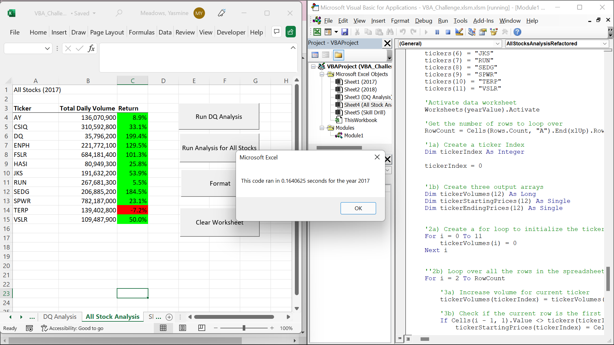
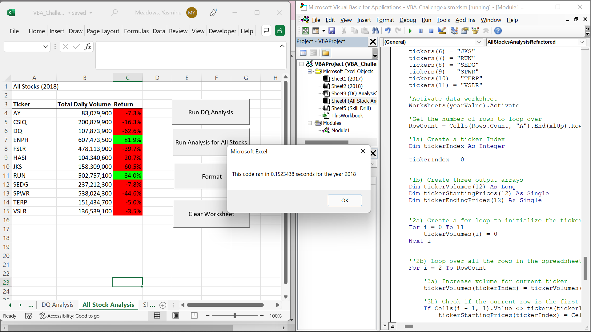

# An Analysis of Green Stocks

Performing an analysis on green energy stock data to determine which to invest in, and refactoring code to run quicker.

# Results
## Stock Peformance
In 2017, almost all of the green stocks had a positive return. However, one stock, TERP had a negative return percentage of -7.2%. In 2018, only two stocks continued to do well. They were ENPH with a return percentage of 81.9%, and RUN with a return percentage of 84%.

## Execution Time
With the original code it took 1.07 seconds to run 2017, and 1.08 seconds for 2018 to run. One reason this took so long to run is because of the nested loop below.
```
For i = 0 To 11
    
        ticker = tickers(i)
        totalVolume = 0
    
        Sheets(yearValue).Activate
        For j = 2 To RowCount
            
            If Cells(j, 1).Value = ticker Then
                
                totalVolume = totalVolume + Cells(j, 8).Value
            
            End If
            
            If Cells(j - 1, 1).Value <> ticker And Cells(j, 1) = ticker Then
            
                startingPrice = Cells(j, 6).Value
                
            End If
            
            If Cells(j + 1, 1).Value <> ticker And Cells(j, 1).Value = ticker Then
            
                endingPrice = Cells(j, 6).Value
                
            End If
        Next j
       
        Worksheets("All Stock Analysis").Activate
        Cells(4 + i, 1).Value = ticker
        Cells(4 + i, 2).Value = totalVolume
        Cells(4 + i, 3).Value = endingPrice / startingPrice - 1
        
    Next i
    
```


However, with the refactored code, it took .16 seconds for 2017 to run and 0.15 seconds for 2018 to run.


 



This took less time because there was no longer a nested loop. Our for looped through all arrays without running so many times. You can see in the code below
```
For i = 0 To 11
        tickerVolumes(i) = 0
    Next i
    
   
    For i = 2 To RowCount
    
        tickerVolumes(tickerIndex) = tickerVolumes(tickerIndex) + Cells(i, 8).Value
        
        If Cells(i - 1, 1).Value <> tickers(tickerIndex) Then
            tickerStartingPrices(tickerIndex) = Cells(i, 6).Value
        End If
        
        If Cells(i + 1, 1).Value <> tickers(tickerIndex) Then
            tickerEndingPrices(tickerIndex) = Cells(i, 6).Value
    
            tickerIndex = tickerIndex + 1
            
        End If
    
    Next i
```

---
# Summary
1.	An advantage of refactoring code is the potential for shortening the execution time. Another advantage is that refactoring makes your code easier to understand. A disadvantage of refactoring code is the possibility of creating a bug that wasn’t there before. Another disadvantage may be the long process of figuring out what could make your code more efficient.
2.	Refactoring my code shortened my execution time by more than half. Also, by refactoring my code, I was able to better understand the logic of what I was doing. However, I did end up creating a lot of bugs that took a lot of time to debug. Fortunately, the instructions kept me from encountering the last disadvantage of figuring out what I needed to do. I can see how that could be a problem in the future when I’m doing it on my own. 
